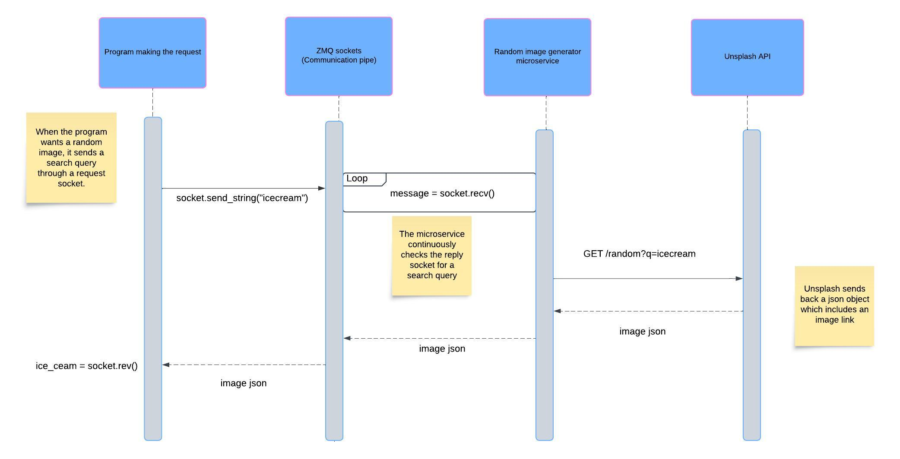

# random_image_generator
A microservice for OSU's CS361.

## Overview ##
The microservice accepts a keyword query. 
It searches 

## Communication policy ##

### How to programatically REQUEST data ###
Use Python's ZeroMQ package to communicate with the microservice.
Create a request socket and bind it to tcp://localhost:5555

Example call:
```
socket.send_string("icecream")
```

### How to programatically RECEIVE data ###
Use the recv() method. The microservice will return a JSON object which includes details about a single random image.
```
ice_cream_json = socket.recv()
```



